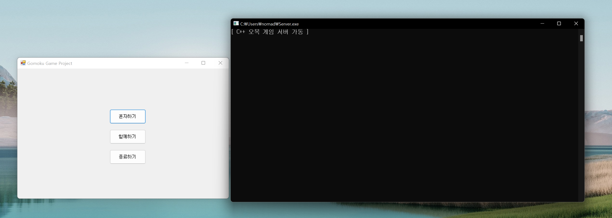
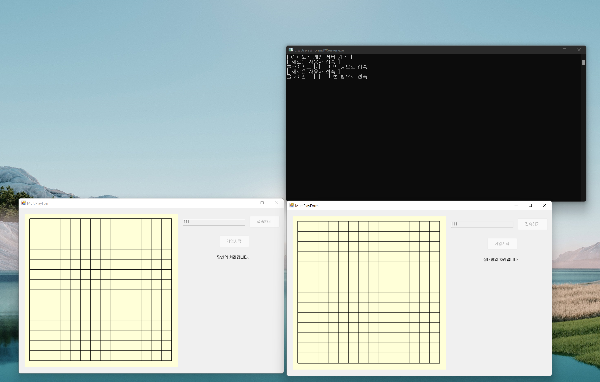
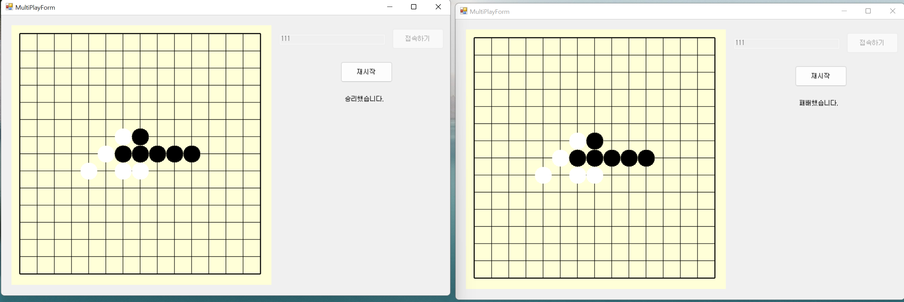

# 인공지능 오목 게임 만들기

## 개요

### 화려한(?) 오목 경력

```
*고등학교 떄까지 무료게임타운 오목 1000전이상에 승률 80퍼센트 이상*

*공군 제17전투비행단 헌병대대 체육대회 오목 부문 우승*
```


저는 어릴 때부터 오목을 좋아했습니다. 한동안 오목을 하지 않다 최근 오랜만에 카카오에 있던 오목을 즐겼는데, 잘 하는 사람이 너무 많아서 특정 급수에서 올라가지 못하고 계속 졌습니다. 제가 어릴 때부터 쓰던 진법이랄까요, 그것의 가짓수도 적고 숙달이 깊게 안되어서 특정 수준 이상부터는 먹히지가 않았습니다. 그래서 인공지능을 이용해 연습을 했었습니다. Yixin이라는 중국에서 만든 것으로 추정되는 프로그램이었는데, 종종 백신 프로그램에서 검출이 되고 중국에서 제작된 프로그램이어서 괜히 께름칙하여 지워버렸고, 이런 비슷한 프로그램을 저도 한 번 만들어보고 싶어졌습니다.

**이 프로젝트는 특히 서버 학습을 목적으로 진행합니다.**  흔히 게임이 잘 동작하지 않으면 대부분이 사람들이 게임 서버를 욕합니다. 채팅 기능은 먹통이 되었는데 게임은 문제없이 진행되는 경우가 있었는데 왜 이런 일이 일어나는지 궁금하였습니다. 정말 게임 서버의 잘못인건지, 게임 서버란 것은 어떻게 제작이 되는지, 나아가 게임은 어떤 식으로 만들어지고 동작을 하는지 궁금하였습니다. 


이 프로젝트는 나동빈님의 인공지능 오목 게임 만들기 자료와 Rookiss님의 게임 서버 강의에서 학습한 내용을 바탕으로 진행되고 있습니다.


### 제작 기간

2021.06 ~ ING


## Updated

- 2021.06 ~ 2021.08
  - C# windows Forms (.NET Framework 4.7.2)  활용하여 오목 게임 화면 구성
  - C++, Winsock을 활용하여 동기적 게임 서버 구현
  - 혼자하기, 함께하기 기능구현
    - 게임방, 세션을 vector로 관리
      - find, delete의 오버헤드가 크기 때문에 map으로 변경 필요
- 2022.06 ~
  - Github cscharpserver 브랜치에서 개발 진행중
  - 클라이언트 `.NET CORE 3.1`로 convert(try-convert 사용)
    - BitConverter의 TryWriteBytes 메소드 및 Span 자료구조 사용 가능
  - C#을 활용한 비동기적 게임 서버 구현 작업 진행 중
    - ServerCore 라이브러리 제작 완료
    - 콘텐츠 구현 및 클라이언트/서버 통신 구현 중
  - 기존 string으로 클라이언트/서버 통신하는 것을 패킷 구조화하여 패킷 통신 변경으로 변경 진행중
  - factory 패턴 학습하여 `SessionManger`, `GameRoomManager`클래스를 제작하여 세션과 게임방 관리 구현


## 게임 화면








## 학습 내용

- Winsock2 라이브러리 학습 및 실습([학습내용](./study/winsock2.md)) 
- boost asio 학습 및 실습([학습내용](./study/boostAsio.md))
- ~~boost 라이브러리 사용 예정 -> 1.76 버전 (msvc-14.2로 빌드)~~ - -> winsock 사용
- 클라이언트 연결될 때마다 스레드 생성하는 방식으로 제작
  - 이로 인해 스레드 생성 오버헤드와 메모리 사용이 크기 때문에 개선 필요
- 추후 자체 제작 네트워크 라이브러리(멀티스레드 + IOCP) 제작해서 붙일 계획
  - 서적(`게임 서버 프로그래밍 교과서`, `게임 서버 프로그래밍 입문`, `해킹 입문자를 위한 TCP/IP 이론과 보안 2/e`), 강의(`[C++과 언리얼로 만드는 MMORPG 게임 개발 시리즈] Part4: 게임 서버`), 블로그(`OVERLAPPED IO 와 IOCP 이야기`[[링크](https://wp.devholicker.com/188)]) 등을 활용하여 학습 진행
- IOCP 학습 및 서버 구현에 많은 시간이 소요되어, 비교적 간단한 C#을 활용한 비동기적 서버 제작 선행을 선행하며 학습 진행 중(`[C#과 유니티로 만드는 MMORPG 게임 개발 시리즈] Part4: 게임 서버` 강의 활용)


## TODO

- [x] 오목 게임 화면 구성
  - [x] 메인 화면(혼자하기, 같이하기, 종료하기)
  - [ ] 현재 생성된 게임방 목록 보여주기, 참여하기 버튼 추가
  - [ ] 게임화면
    - [x] 싱글 게임
    - [x] 멀티 게임
    - [ ] 인공지능 게임
    - [ ] 기권하기 버튼 추가
    - [ ] 기권하면 방 파괴 후 로비로 이동
- [ ] 오목 게임 로직 구현(오목 게임 승패 판정) - 렌주룰 기반
  - [x] 돌이 5개가 되었을 때 승리 판정
  - [ ] 33, 44 불가능
  - [ ] 백은 6목, 33, 44 가능.
- [x] 멀티 게임 서버 구현
  - [x] winsock 활용한 동기적 서버
  - [ ] C#을 활용한 비동기적 서버
  - [ ] IOCP 활용한 비동기적 서버

- [ ] 게임로직 서버로 이관
- [ ] 인공지능 기능 탑재(Alpha-Beta prunning 알고리즘 적용)
  - [ ] Alpha-Beta prunning 알고리즘 구현(DFS 기반)
  - [ ] Alpha-Beta prunning 알고리즘의 평가함수 연구 및 결정
- [ ] 게임 참여자 뿐만 아니라 관전자도 방에 입장할 수 있도록 개선
- [ ] 온라인 실시간 채팅 서비스 구현(게임방 내)
- [ ] Open SSL 적용
- [ ] 클라이언트 코드 난독화
- [ ] JWT 적용
- [ ] Redis 연동
- [ ] 더미 클라이언트 생성 및 부하 테스트 프로그램 제작


## 참고 자료

- [패스트캠퍼스 컴퓨터공학 올인원 강의 중 나동빈님 오목 게임 프로젝트 파트](https://fastcampus.co.kr/dev_online_cs)
- [Rookiss님의 C++ 게임 서버 강의](https://www.inflearn.com/course/%EC%96%B8%EB%A6%AC%EC%96%BC-3d-mmorpg-4/) 
- [OVERLAPPED IO 와 IOCP 이야기](https://wp.devholicker.com/188)
- 게임 서버 프로그래밍 입문
- 게임 서버 프로그래밍 교과서

 

