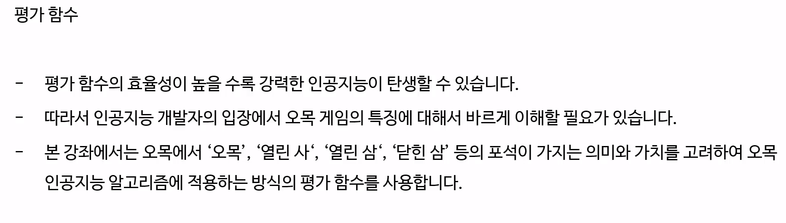
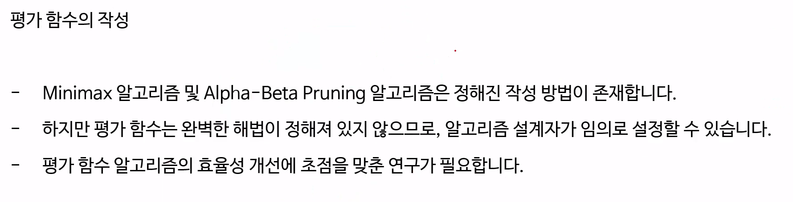

-> 깊이우선탐색으로 구현이 되고, 기본적으로 모든 노드를 탐색하게 된다. 그래서 모든 노드를 탐색하는 것은 엄청난 연산이 필요하다.

 

ex)

오목 : 1000000

열린사: 20000

하나닫힌사: 5000

닫힌사: 1500

열린삼: 4000

하나 닫힌삼: 1500

열린 이 : 1500

닫힌 삼 : 300 

닫힌 이 : 50

하나 닫힌 이 :300

바둑판의 천원점과 가까울 수록 점수 가산하기 

