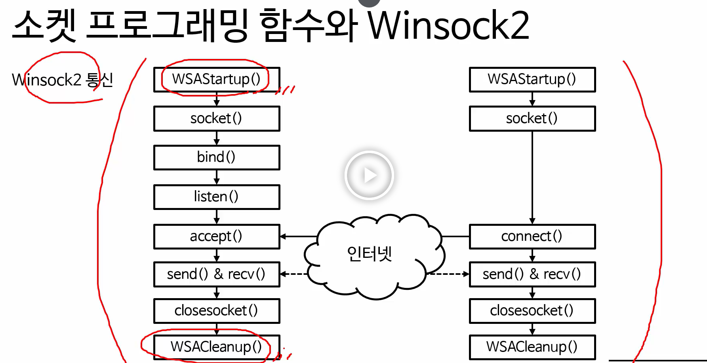

# winsock2

## 소켓 생성

### socket(네트워크 주소체계, 소켓 타입, 프로토콜)

네트워크 주소체계 : IPv4(AF_INET), IPv6(AF_INET6)

소켓 타입 : TCP(SOCK_STREAM), UDP(SOCK_DGRAM)

프로토콜 : TCP(IPPROTO_TCP), UDP(IPPROTO_UDP)

## binding

### bind(소켓 변수, 서버 주소 구조체, 서버 주소 구조체의 크기)

서버 측의 소켓에 IP와 포트 번호를 할당하는 것

- IPv4 소켓 주소 구조체(SOCKADDR_IN): 소켓 주소체계(sin_family), 포트(sin_port), IPv4주소(sin_addr)
- 실제로 소켓 주소 구조체를 이용할 때는 IPv4 소켓 주소 구조체를 일반 소켓 구조체(SOCKADDR)로 변환하여 사용해야함

## listen

### listen(소켓 변수, 백 로그 큐의 크기)

클라이언트로부터 연결 요청을 기다립니다. 백 로그란 동시에 연결을 시도하는 최대 클라이언트의 수를 의미

## connect

### connect(소켓 변수, 서버 주소 구조체, 서버 주소 구조체의 크기)

클라이언트 측에서 서버에 연결을 요청. 소켓 생성에 실패할 경우 -1을 반환

- IPv4 소켓 주소 구조체: 소켓 주소체계(sin_family), 포트 번호(sin_port), IPv4 주소 (sin_addr)
- 실제로 소켓 주소 구조체를 이용할 때는 IPv4 소켓 주소 구조체를 일반 소켓 구조체(SOCKADDR)로 변환하여 사용해야함

## accept

### accept(소켓 변수, 클라이언트 주소 구조체 변수, 클라이언트 주소 구조체 크기)

서버 측에서 클라이언트의 연결을 수락.  accpet() 함수 내부에서 클라이언트 주소를 설정한 뒤에 통신에 사용할 클라이언트의 소켓을 반환. 오류가 발생하는 경우 -1을 반환

- 실제로 소켓 주소 구조체를 이용할 때는 IPv4 소켓 주소 구조체를 일반 소켓 구조체(SOCKADDR)로 변환하여 사용해야함

## send

### send(소켓 변수, 문자열 버퍼, 문자열 버퍼 크기, 플래그)

상대방에게 데이터 전송. 특정한 소켓으로 문자열 버퍼에 담긴 내용을 문자열 버퍼에 담긴 내용을 전송한다. 플래그는 특별한 경우가 아니라면 0으로 설정. 보내는 데이터가 어떤 데이터인지 표시하기 위해 사용. 가령 플래그를 1로 보내면 중요한 메시지를 나타내는 식으로. 데이터 전송에 실패하는 경우 -1을 반환.

## recv(소켓 변수, 문자열 버퍼, 문자열 버퍼 크기, 플래그)

데이터를 수신하여 특정 문자열 버퍼에 담는다. 플래그는 특별한 경우가 아니면 0으로 설정하고 데이터 전송에 실패하는 경우 -1을 반환.

## closesocket(소켓 변수)

열린 소켓을 닫는다

## WSAStartup

### WSAStartup(winsock 버전, WSA 데이터 변수)

사용한 winsock의 버전을 설정. 관련 설정 정보를 받기 위해 WSADATA 변수를 함께 넣어준다.

## 출처

- 패스트캠퍼스 : 컴퓨터공학 올인원 패키지

